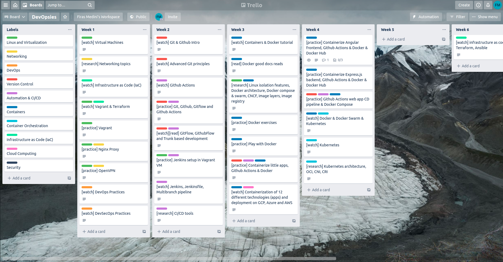

# DevOpsies
## Start your DevOps learning journey here ^_^

I made this thing to help people get into DevOps.

DevOpsies got a Trello board at <a target="_blank" href="https://trello.com/b/f99ESJWO/devopsies">trello.com/b/f99ESJWO/devopsies</a>, where various DevOps learning resources are gathered there, and split into several weeks. It helps define a learning goal for each week. The resources I gathered are online videos, articles, research topics, as well as workshops I made from scratch. Therefore, you'll find yourself watching, reading, researching, and practicing. The workshops I make are hosted on Github <a target="_blank" href="https:///github.com/devopsies">github.com/devopsies</a>, but they are also referenced in the Trello board.

If you need any help, have any feedback, or just wanna say thanks to encourage me, you can contact me at <a target="_blank" href="mailto:mdnfiras@outlook.com">mdnfiras@outlook.com</a>.

Good luck :D